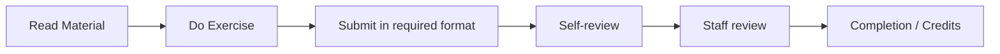

# Chapter 1 - Getting Started

## Metadata

| Field   | Value                        |
| ------- | ---------------------------- |
| Course  | DevOps with Docker (MOOC.fi) |
| Chapter | 1                            |
| Section | 1                            |
| Topic   | Getting Started              |

---

## Overview

This section introduces the course structure, how exercises and grading work, the submission process, and the expectations around prerequisites and safe Docker usage. It also covers responsible use of LLMs and where to get support.

---

## Learning Objectives

After completing this section, you should be able to:

* Explain how the course is structured and graded (chapters, mandatory exercises, allowed skips).
* Describe the exercise submission flow and why formatting matters.
* Verify Docker is installed and understand the security implications of Docker access.
* Use LLMs as helpers while keeping responsibility for correctness and safety.

---

## Core Concepts

### Definition

**Mandatory exercise**: An exercise that cannot be skipped when completing a chapter.  
**Exercise submission**: A structured answer submitted in the format required by the course.

### Explanation

The course is designed to be completed in order. Each chapter builds on earlier material, and exercises are placed to reinforce concepts before moving on. You can skip at most one non-mandatory exercise per chapter, but every mandatory exercise must be completed.

Docker gives containers strong access to the host system. Adding your user to the `docker` group removes the need for `sudo`, but it also grants elevated access. Treat Docker commands with the same care as administrative actions.

LLMs can help clarify configurations and debug errors, but they can also be wrong or misleading. Always validate outputs and make sure you understand what you run.

### Examples

* Chapter 2 requires **15/16** exercises to pass; Chapter 3 and Chapter 4 each require **10/11**.
* The course deadline for submissions is **16 June 2026**; after that, exercises are locked.
* Chapter 1 has no ECTS credits; Chapters 2-4 each grant **1 ECTS** when completed.

### Diagrams



---

## Architecture / Workflow

The learning workflow focuses on sequential reading and exercise submission.

### Workflow Steps

1. Read the chapter material in order.
2. Complete exercises as they appear.
3. Submit answers in the required format.
4. Review your own submission after the example solution is shown.
5. Wait for staff review and grading.

---

## Commands Learned

```bash
# Check Docker installation and version
docker -v
```

### Command Reference

| Command   | Purpose                                 |
| --------- | --------------------------------------- |
| docker -v | Print the installed Docker CLI version. |

---

## Practical Examples

### Example 1

Verify Docker is installed before starting exercises.

```bash
docker -v
```

Expected output:

```text
Docker version <version>
```

---

## Quick Revision

* The course is sequential; exercises reinforce the material as you go.
* You may skip one non-mandatory exercise per chapter, but mandatory exercises must be completed.
* Submissions must follow the required format or they can be rejected.
* Docker access is powerful; treat it like admin access.
* LLMs are helpful, but you are responsible for correctness and safety.

---

## Interview Questions

### Q1. Why is adding a user to the `docker` group a security consideration?

It allows running containers without `sudo`, which effectively grants elevated access to the host system.

### Q2. What is the minimum exercise completion requirement per chapter?

Chapter 2: 15/16, Chapter 3: 10/11, Chapter 4: 10/11, with all mandatory exercises completed.

### Q3. What is the main risk of relying on LLMs for Docker configurations?

They can produce convincing but incorrect or insecure configurations, so you must validate and understand the output.

---

## Common Mistakes

* Skipping a mandatory exercise and expecting the chapter to pass.
* Submitting answers in the wrong format or missing required content.
* Modifying the example application code when the exercise forbids it.
* Treating Docker commands as harmless despite their elevated access.
* Copying LLM output without understanding or verifying it.

---

## References

* [MOOC.fi Course Material](https://courses.mooc.fi/org/uh-cs/courses/devops-with-docker-spring-2026/chapter-1)
* [Docker Documentation](https://docs.docker.com/)
* [Course Discord](https://discord.gg/your-discord-invite) (support and discussion)

---

## Key Takeaways

* Follow the course in order and complete required exercises.
* Submit exercises in the specified format and complete self-reviews.
* Verify Docker installation and understand the security implications.
* Use LLMs as helpers, not as replacements for understanding.