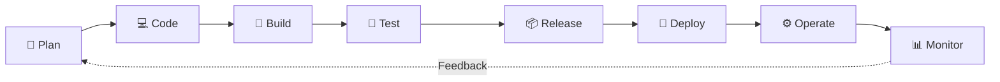
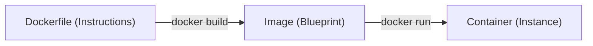
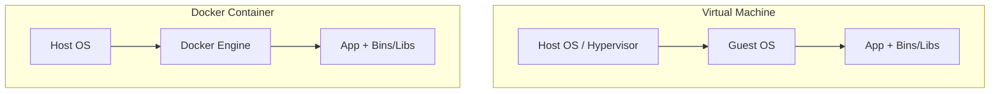

# Chapter 2.1 - Definitions and basic concepts

## Overview

This section introduces the foundational concepts of DevOps and Docker. It covers what containers and images are, the problems they solve, how they differ from Virtual Machines, and the basic CLI commands used to manage them.

---

## Learning Objectives

After completing this section, you should be able to:

- Define DevOps and its primary purpose.
- Explain the differences between Docker, containers, and images.
- Understand the benefits of using containers over traditional Virtual Machines.
- Use basic Docker CLI commands to manage images and containers.

---

## Core Concepts

### DevOps

A development methodology aimed at bridging the gap between Software Development (Dev) and IT Operations (Ops). It emphasizes that the team developing the software should also be responsible for its release, configuration, and monitoring.

### DevOps Lifecycle



### Docker

A platform that provides a set of tools to deliver software in standardized, isolated units called containers using OS-level virtualization.

### Container

A lightweight, standalone, executable package of software that includes everything needed to run an application: code, runtime, system tools, system libraries, and settings. Containers are isolated from each other and the host system.

### Image

A read-only, immutable file that acts as a blueprint or template for creating containers. It is built using instructions defined in a `Dockerfile`.

### Diagrams



---

## Architecture / Workflow

### Docker Architecture

Docker uses a client-server architecture:

1. **Docker CLI Client**: The command-line interface where you type commands.
2. **REST API**: The communication bridge between the client and the daemon.
3. **Docker Daemon**: The background service running on the host machine that handles the heavy lifting: building, running, and managing containers and images.

### Containers vs Virtual Machines (VMs)

- **Virtual Machines**: Include a full guest Operating System on top of a hypervisor. They provide strong hardware-level isolation but are heavy, consume more resources, and are slower to start.
- **Containers**: Share the host machine's OS kernel. They are lightweight, start almost instantly, and provide process-level isolation. _(Note: On macOS and Windows, Docker runs a hidden Linux VM to provide the required kernel)._



### Benefits of Containers

1. **Solves "Works on my machine"**: Packages the app with its exact required dependencies.
2. **Isolated Environments**: Run multiple apps with conflicting dependencies on the same host without issues.
3. **Easier Development**: Instantly spin up complex dependencies (like databases) without installing them directly on your machine.
4. **Scalability**: Low overhead means you can rapidly spin up or destroy instances to meet varying demand.

---

## Commands Learned

```bash
# Run a container from an image
docker container run <image>

# List all containers (running and stopped)
docker container ls -a

# Stop a running container
docker container stop <container_id_or_name>

# Remove a container
docker container rm <container_id_or_name>

# List local images
docker image ls

# Remove an image
docker image rm <image>
```

### Command Reference

| Command                  | Shorthand       | Purpose                                                                                 |
| ------------------------ | --------------- | --------------------------------------------------------------------------------------- |
| `docker container run`   | `docker run`    | Creates and starts a container from an image. Downloads the image if not found locally. |
| `docker container ls -a` | `docker ps -a`  | Lists all containers. Omit `-a` to see only running containers.                         |
| `docker container stop`  | `docker stop`   | Gracefully stops a running container.                                                   |
| `docker container rm`    | `docker rm`     | Removes a stopped container. Use `--force` to remove a running one.                     |
| `docker image ls`        | `docker images` | Lists all locally stored images.                                                        |
| `docker image rm`        | `docker rmi`    | Removes an image. Fails if a container is referencing it.                               |
| `docker image pull`      | `docker pull`   | Downloads an image from a registry (like Docker Hub) without running it.                |
| `docker container exec`  | `docker exec`   | Executes a command inside an already running container.                                 |

---

## Practical Examples

### Running a container in the background

```bash
docker run -d nginx
```

Expected output:

```text
c7749cf989f61353c1d433466d9ed6c45458291106e8131391af972c287fb0e5
```

_Explanation: Starts the `nginx` web server container. The `-d` (detached) flag runs it in the background, freeing up your terminal._

### Removing unused resources

```bash
docker system prune
```

_Explanation: Cleans up unused containers, networks, and dangling images to free up space. Useful when your Docker environment becomes cluttered._

---

## Quick Revision

- Images are read-only blueprints; containers are running instances of images.
- Dockerfiles create Images. Images create Containers.
- Containers are generally lighter and faster than VMs because they share the host's OS kernel.
- The Docker CLI communicates with the Docker Daemon via a REST API.
- You must stop a container before you can remove it, and you must remove a container before you can remove the image it was based on.

---

## Interview Questions

### Q1. What is the difference between a Docker image and a Docker container?

An image is an immutable, read-only template containing the application and its dependencies (like a recipe). A container is a running, isolated instance of that image (like the cooked meal).

### Q2. How do Docker containers differ from Virtual Machines?

VMs virtualize the hardware and require a full guest Operating System for every instance, making them heavy. Containers virtualize the operating system, sharing the host OS kernel, which makes them much lighter, faster to start, and more resource-efficient.

### Q3. How does Docker solve the "works on my machine" problem?

It packages the application alongside its exact dependencies, libraries, and runtime environment into a single container. If the container runs on the developer's machine, it will run exactly the same way on the production server.

---

## Common Mistakes

- **Confusing images and containers**: Trying to run commands on an image instead of a container.
- **Forgetting to stop a container before removing it**: Trying to run `docker rm` on a running container without the `--force` flag will result in an error.
- **Deleting images that are still in use**: Attempting `docker rmi` when a stopped container is still based on that image. You must remove the container first.
- **Leaving unused containers and images around**: Not pruning regularly can quickly consume all available disk space.

---

## References

- [MOOC.fi Course Material](https://courses.mooc.fi/org/uh-cs/courses/devops-with-docker-spring-2026/chapter-2/definitions-and-basic-concepts)
- [Docker Overview (Official Docs)](https://docs.docker.com/get-started/overview/)
- [Docker CLI Reference](https://docs.docker.com/engine/reference/commandline/cli/)

---

## Key Takeaways

- DevOps merges development and operations to improve software delivery.
- Docker provides a standardized way to package and isolate applications.
- Containers share the kernel, making them highly efficient compared to VMs.
- The Docker CLI talks to the Docker Daemon via a REST API.
- Always clean up unused containers and images to save disk space.
