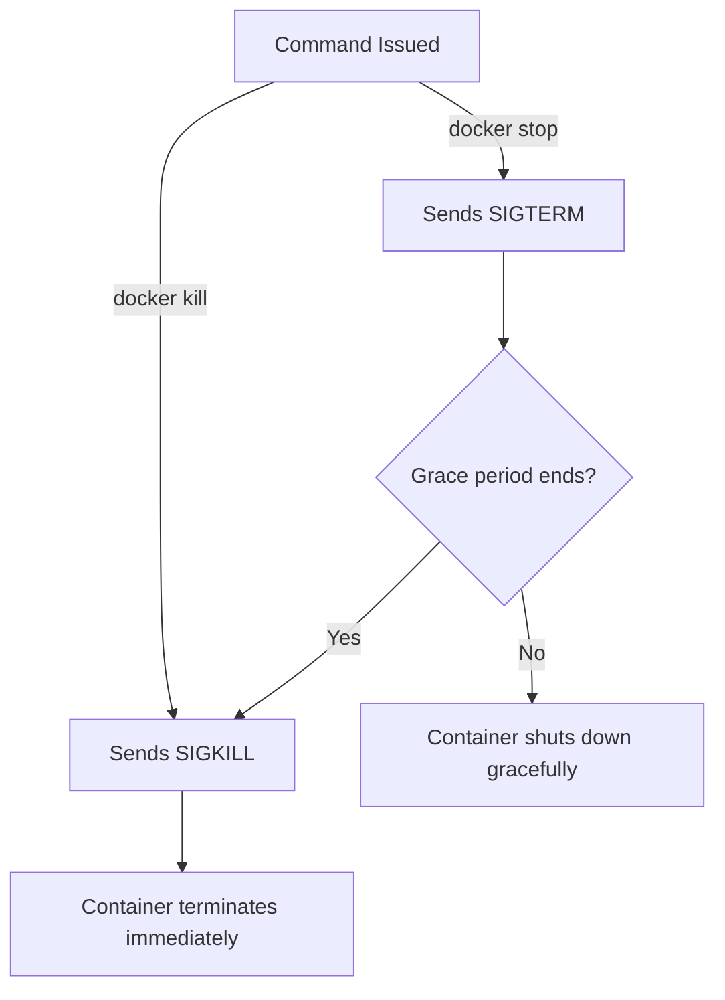

# Chapter 2.2 - Running and stopping containers

## Overview

This section dives deeper into container management. It covers how to interact with running containers, follow their logs, execute commands inside them, and properly manage their lifecycle (pausing, stopping, killing, and detaching).

---

## Learning Objectives

After completing this section, you should be able to:

* Run interactive terminal sessions inside containers.
* Follow live log outputs from detached containers.
* Attach to and gracefully detach from running containers without terminating them.
* Execute secondary commands within an already running container.
* Understand the technical difference between stopping and killing a container.
* Understand multi-platform images and architecture warnings.

---

## Core Concepts

### Interactive Mode

By default, containers run isolated from your host's terminal. To interact with a container (like typing commands into a bash shell), you must instruct Docker to keep the standard input (STDIN) open and allocate a pseudo-TTY (terminal). This is done using the `-i` and `-t` flags, almost always combined as `-it`.

### Container Primary Process (PID 1)

A container stays alive as long as its primary process (PID 1) is running. If you attach to a container and press `Ctrl+C`, you usually kill that primary process, causing the container to exit. 

### Ephemeral Nature of Containers

A container functions like a standard operating system (e.g., Ubuntu). You can install software inside it using package managers like `apt-get`. However, **these changes are not permanent**. If the container is removed, all manual changes are permanently lost.

---

## Commands Learned

### Command Reference

| Command | Purpose |
| ------- | ------- |
| `docker run -it <image>` | Runs a container and attaches an interactive terminal session to it. |
| `docker run -d <image>` | Runs a container in detached mode (background). |
| `docker run --name <name> <image>` | Assigns a custom, memorable name to the container instead of a random string. |
| `docker run --rm <image>` | Automatically removes the container from the daemon as soon as it exits. |
| `docker logs -f <container>` | Tails and follows the standard output (STDOUT) of the container, showing live logs. |
| `docker pause / unpause <container>` | Suspends/resumes all processes inside the container without exiting them. |
| `docker attach <container>` | Connects your host terminal's STDIN/STDOUT to the container's primary running process. |
| `docker exec -it <container> <command>`| Executes a *new* interactive command (like `bash`) inside an already running container. |
| `docker kill <container>` | Forcefully and immediately terminates the container. |

---

## Practical Examples

### Running an interactive, self-cleaning shell

```bash
docker run -it --rm ubuntu
```

Expected result:
You are dropped into a `root` bash prompt inside the Ubuntu container. When you type `exit`, the container stops and is automatically removed because of the `--rm` flag, leaving your system clean.

### Executing a command inside a running container

Assuming you have a background container named `looper`:

```bash
docker exec -it looper bash
```

Expected result:
You open a *secondary* interactive bash shell inside `looper`. You can explore the filesystem or check processes (e.g., using `ps aux`). Exiting this shell will close the shell process, but the main `looper` container will keep running.

---

## Architecture / Workflow

### Stopping vs. Killing

When you instruct Docker to terminate a container, it handles the signals differently:



### Detaching Gracefully

If you are attached to a container's primary process (via `docker run -it` or `docker attach`), hitting `Ctrl+C` will kill the process and stop the container. 

To detach *without* killing the container, use the Docker escape sequence:
**`Ctrl+P, Ctrl+Q`**

Alternatively, you can attach using `docker attach --no-stdin <container>`. In this mode, `Ctrl+C` only disconnects your terminal, leaving the container running.

---

## Quick Revision

* Use `-it` to interact with containers.
* Use `--name` to give containers readable names instead of random ones.
* Use `--rm` for throwaway containers to prevent disk space clutter.
* `docker logs -f` is the primary way to observe background containers.
* `docker exec` is essential for debugging running containers.
* Changes made inside a container (like installing nano or creating files) disappear if the container is removed.

---

## Interview Questions

### Q1. What is the difference between `docker attach` and `docker exec`?

`docker attach` connects your host's terminal to the *existing primary process* (PID 1) of the container. `docker exec` starts a *completely new, secondary process* inside the running container (such as opening a new bash shell for debugging).

### Q2. What is the difference between `docker stop` and `docker kill`?

`docker stop` attempts a graceful shutdown by sending a `SIGTERM` signal. If the application doesn't stop within a grace period (default 10 seconds), it follows up with a `SIGKILL`. `docker kill` sends a `SIGKILL` immediately, forcefully terminating the process without giving it time to clean up.

### Q3. Why might you see a "Nonmatching host platform" warning when running an image?

This occurs when the image was built for a different processor architecture (e.g., `linux/amd64`) than the host machine running Docker (e.g., an `arm64` Apple Silicon Mac). Docker runs these via an emulator, which works but causes a performance penalty.

---

## Common Mistakes

* **Accidentally killing a container with `Ctrl+C`**: Forgetting to use the escape sequence (`Ctrl+P, Ctrl+Q`) when trying to exit an attached terminal session.
* **Confusing `stop` and `rm`**: Thinking `docker rm` will stop a running container. You must `stop` it first, or use `docker rm --force` (which kills and then removes it).
* **Quoting issues on Windows**: Trying to pass complex scripts to `sh -c` using single quotes (`'`) in the Windows Command Prompt. Windows CMD requires double quotes (`"`).

---

## References

* [MOOC.fi Course Material](https://courses.mooc.fi/org/uh-cs/courses/devops-with-docker-spring-2026/chapter-2/running-and-stopping-containers)
* [Docker Exec Documentation](https://docs.docker.com/engine/reference/commandline/exec/)
* [Docker Run Documentation](https://docs.docker.com/engine/reference/commandline/run/)

---

## Key Takeaways

* Flags like `-it`, `-d`, and `--rm` are fundamental for day-to-day Docker usage.
* You can safely peek inside running applications using `docker logs` and `docker exec`.
* Always be aware of whether you are attached to the primary process (which will die on Ctrl+C) or a secondary process.
* Running images on incompatible processor architectures works via emulation but impacts performance.
