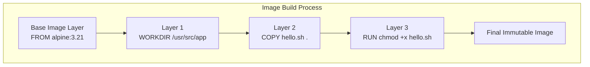

# Chapter 2.3 - In-depth dive into images

## Overview

This section explores Docker images in detail. It covers how to find and pull images from registries like Docker Hub, how images are constructed using layers, and how to automate image creation using Dockerfiles. It also discusses the difference between reproducible builds (via Dockerfiles) and manual image commits.

---

## Learning Objectives

After completing this section, you should be able to:

* Search for and pull images from Docker Hub and custom registries.
* Understand the anatomy of a Docker image name and tag.
* Write a basic `Dockerfile` using `FROM`, `WORKDIR`, `COPY`, `RUN`, and `CMD`.
* Build a custom image from a `Dockerfile`.
* Understand how image layers work and how they benefit the build cache.
* Recognize why `docker commit` is considered a bad practice compared to using Dockerfiles.

---

## Core Concepts

### Docker Registries

A registry is a centralized service for storing and distributing container images. Docker Hub is the default registry. You can pull images from other registries (like `quay.io`) by prefixing the image name with the registry address.

### Image Name Anatomy

An image name generally follows this structure:
`registry/organisation/image:tag`

* **Official Images**: Have no prefix (e.g., `ubuntu`). They default to the `library` organization on Docker Hub.
* **Unofficial Images**: Have a user or organization prefix (e.g., `devopsdockeruh/simple-web-service`).
* **Tags**: Labels applied to images to denote specific versions or variants (e.g., `ubuntu:24.04`). If omitted, it defaults to the `latest` tag.

### Image Layers

Images are built iteratively as a series of read-only layers. Each instruction in a Dockerfile usually represents a layer. If you rebuild an image and a specific instruction hasn't changed, Docker speeds up the process by reusing the cached layer.

### Dockerfile

A plain text file containing a sequence of instructions used to automate the building of a Docker image. It serves as "Infrastructure as Code" for your container environments.

### Diagram



---

## Architecture / Workflow

### Automated Building vs. Manual Commits

1. **The Dockerfile Way (Best Practice)**:
   You define exact dependencies and steps in a `Dockerfile`. You run `docker build` to execute those steps and generate an image. This process is highly reproducible and version-controllable.

2. **The Commit Way (Anti-pattern)**:
   You run a container, use `docker cp` to copy files into it or run commands manually, and then use `docker commit` to snapshot the running container into a new image. This creates a "black box" where nobody knows exactly how the image was configured.

---

## Commands Learned

### CLI Commands

| Command | Purpose |
| ------- | ------- |
| `docker search <term>` | Searches Docker Hub for images matching the term. |
| `docker pull <image>:<tag>` | Downloads an image and a specific tag from a registry. |
| `docker tag <old> <new>` | Creates a new tag referencing an existing local image. |
| `docker build -t <name> .` | Builds an image from the `Dockerfile` in the current directory (`.`). |
| `docker cp <host_path> <container>:<dest>` | Copies a file from the host machine into a running container. |
| `docker diff <container>` | Shows changes made to a container's filesystem (Added, Changed, Deleted). |
| `docker commit <container> <name>` | Saves a modified container as a new image. *(Anti-pattern)* |

### Dockerfile Instructions

| Instruction | Purpose |
| ----------- | ------- |
| `FROM` | Specifies the base image to build upon. Must be the first instruction. |
| `WORKDIR` | Sets the working directory inside the image for subsequent instructions. |
| `COPY` | Copies files from the host machine's build context into the image. |
| `RUN` | Executes a shell command **during the image build phase** (e.g., installing packages). |
| `CMD` | Defines the default command to execute **when the container runs**. |

---

## Practical Examples

### Building a custom image

**1. Create a `Dockerfile`:**
```dockerfile
# Start from Alpine Linux (a very small Linux distribution)
FROM alpine:3.21

# Set the working directory
WORKDIR /usr/src/app

# Copy a script from host to container
COPY script.sh .

# Execute command during build to make script executable
RUN chmod +x script.sh

# Execute script when container starts
CMD ["./script.sh"]
```

**2. Build the image:**
```bash
docker build -t my-script-image:v1 .
```
*(The `.` tells Docker to look for the Dockerfile in the current directory).*

---

## Quick Revision

* Official Docker Hub images have no prefix. Unofficial ones have a user or organization prefix.
* The `latest` tag just means the default tag assigned if none is specified; it doesn't strictly guarantee it's the absolute newest software version (e.g., Ubuntu uses it for the latest LTS).
* `RUN` prepares the image at build time. `CMD` runs the application at runtime.
* Layers speed up the build process because unchanged instructions use the cache.

---

## Interview Questions

### Q1. What is a Dockerfile?

A plain text file containing a series of instructions (`FROM`, `RUN`, `COPY`, etc.) that Docker uses to automatically assemble an image. It acts as the "recipe" for an environment.

### Q2. Why are small base images like Alpine Linux preferred over full Ubuntu images?

Small images download much faster, consume less disk space and memory, and have a smaller attack surface, reducing the risk of security vulnerabilities.

### Q3. Why is using `docker commit` considered bad practice?

It creates a "black box" image where the exact steps taken to produce it are not documented. Dockerfiles provide Infrastructure-as-Code, ensuring builds are reproducible, auditable, and version-controlled.

---

## Common Mistakes

* **Forgetting the build context `.`**: Running `docker build -t my-app` without specifying the path `.` at the end will result in an error.
* **Assuming `latest` is always the newest release**: Always verify what the maintainers map the `latest` tag to. For production, pin specific version tags (e.g., `alpine:3.21`) instead of relying on `latest`.
* **Confusing `RUN` and `CMD`**: Trying to run an application loop or start a server using `RUN`. `RUN` is only for setting up the image during the build; `CMD` is what keeps the container running later.
* **Windows Line Endings**: Windows users running into "not found" errors because a copied `.sh` script has Windows `CRLF` line endings instead of Unix `LF` line endings.

---

## References

* [MOOC.fi Course Material](https://courses.mooc.fi/org/uh-cs/courses/devops-with-docker-spring-2026/chapter-2/in-depth-dive-into-images)
* [Dockerfile Reference](https://docs.docker.com/engine/reference/builder/)
* [Docker Build Reference](https://docs.docker.com/engine/reference/commandline/build/)

---

## Key Takeaways

* Everything in Docker relies on images.
* Images are composed of cacheable layers, which make subsequent builds highly efficient.
* Always use a `Dockerfile` for reproducible image builds instead of relying on manual `docker commit` snapshots.
* Understand the difference between what happens at build time (`RUN`) vs run time (`CMD`).
