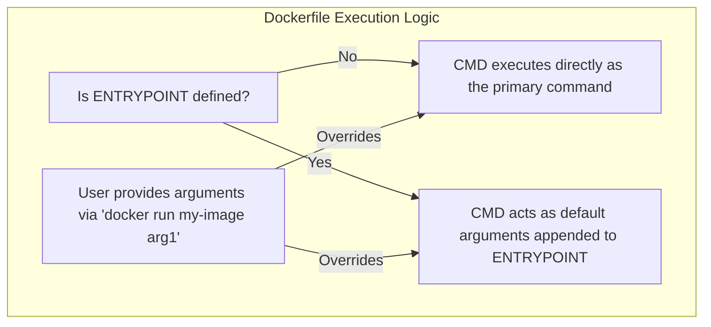

# Chapter 2.4 - Defining start conditions for the container

## Overview

This section focuses on the relationship and differences between `CMD` and `ENTRYPOINT` in a Dockerfile. It explains how to correctly configure a container to behave like a standard executable. Additionally, it covers how to structure Dockerfiles for caching efficiency and how to prototype container environments interactively before writing them into code.

---

## Learning Objectives

After completing this section, you should be able to:

* Iteratively prototype a container environment using interactive sessions.
* Optimize Dockerfile layer caching by ordering instructions correctly.
* Understand the distinct roles of `CMD` and `ENTRYPOINT`.
* Utilize `CMD` to provide default arguments to an `ENTRYPOINT`.
* Differentiate between the "exec" and "shell" formatting forms in Dockerfiles.

---

## Core Concepts

### Interactive Prototyping

Instead of blindly guessing which commands to put in a `Dockerfile`, it is common practice to start a base image interactively (e.g., `docker run -it ubuntu:24.04`), manually execute installations and configuration commands until the environment works, and *then* copy those successful commands into the `Dockerfile` as `RUN` instructions.

### Layer Caching Optimization

Docker processes `Dockerfile` instructions from top to bottom. If a layer changes, all subsequent layers below it must be rebuilt. 
To speed up builds:
* Place slow, rarely changing commands (like `apt-get install`) at the **top**.
* Place fast, frequently changing commands (like copying your application source code) at the **bottom**.

### ENTRYPOINT vs CMD

* **`ENTRYPOINT`**: Defines the strict executable that the container *must* run. 
* **`CMD`**: Defines the default arguments passed to that `ENTRYPOINT`. 

If a user provides arguments at the end of a `docker run` command, those arguments *override* the `CMD` but do *not* override the `ENTRYPOINT`—they are simply appended to it.

### Exec Form vs Shell Form

Instructions like `RUN`, `CMD`, and `ENTRYPOINT` can be written in two ways:

1. **Exec form (JSON array)**: `ENTRYPOINT ["executable", "param1"]`. **(Preferred)**. The command runs directly as the primary process.
2. **Shell form (String)**: `ENTRYPOINT executable param1`. Docker wraps this in `/bin/sh -c`. This can break system signal handling (making containers hard to stop cleanly) but is necessary if you need to evaluate shell environment variables.

### Diagram: Execution Logic



---

## Architecture / Workflow

### Turning a container into an executable

By combining `ENTRYPOINT` and `CMD`, you can make a container behave exactly like a native command-line tool.

1. Define the tool as the `ENTRYPOINT`.
2. Define a default behavior using `CMD`.
3. Allow the user to override the behavior simply by passing arguments to `docker run`.

---

## Commands Learned

### CLI Commands

| Command | Purpose |
| ------- | ------- |
| `docker cp <container>:<src> <dest>` | Copies files from a container's filesystem to the host machine. |

### Dockerfile Instructions

| Instruction | Purpose |
| ----------- | ------- |
| `ENTRYPOINT` | Configures a container that will run as an executable. |

---

## Practical Examples

### Executable Dockerfile Pattern

```dockerfile
# 1. Base Image
FROM ubuntu:24.04

# 2. Setup (Slow steps cached at the top)
RUN apt-get update && apt-get install -y curl

# 3. Define the strict executable (Exec form)
ENTRYPOINT ["curl"]

# 4. Define default arguments
CMD ["https://helsinki.fi"]
```

**Usage:**
```bash
# Runs: curl https://helsinki.fi
docker run my-curler

# Runs: curl https://google.com (overrides the CMD)
docker run my-curler https://google.com
```

---

## Quick Revision

* `ENTRYPOINT` = The strict executable.
* `CMD` = The default arguments to the executable.
* Overriding `CMD` is easy (just add arguments to `docker run`). Overriding `ENTRYPOINT` requires the explicit `--entrypoint` flag.
* Always use the Exec form `["command", "arg"]` unless you specifically need shell variable expansion.
* Put commands that change often at the bottom of your Dockerfile to maximize cache hits.

---

## Interview Questions

### Q1. What is the difference between `CMD` and `ENTRYPOINT`?

`ENTRYPOINT` sets the main process that will always run when the container starts. `CMD` provides the default arguments to that process. If no `ENTRYPOINT` is defined, `CMD` is executed directly as the main process.

### Q2. Why is the JSON array (Exec form) preferred over the string (Shell form) for `CMD` and `ENTRYPOINT`?

The shell form automatically wraps the command in `/bin/sh -c`. This makes the shell the primary process (PID 1) instead of your application. Consequently, your application won't directly receive system signals (like `SIGTERM` when you try to stop the container), which leads to delayed, forced shutdowns.

### Q3. How should you order instructions in a Dockerfile to optimize build times?

Place instructions that are less likely to change (like downloading OS updates and installing base dependencies) at the top. Place instructions that change frequently (like copying the application source code) at the bottom. This ensures Docker can reuse the cached layers for the slow installation steps every time your code changes.

---

## Common Mistakes

* **Using Shell Form blindly**: Writing `CMD myapp start` instead of `CMD ["myapp", "start"]` and wondering why the container takes 10 seconds to stop when you run `docker stop`.
* **Poor Caching**: Putting `COPY . .` (copying the whole app) at the very top of the Dockerfile, causing `apt-get install` to re-run and re-download packages every single time a single line of code changes.
* **Overriding Confusion**: Using `CMD` for an executable that requires arguments, and getting confused when running `docker run my-image my-arg` completely replaces the executable instead of appending the argument to it.

---

## References

* [MOOC.fi Course Material](https://courses.mooc.fi/org/uh-cs/courses/devops-with-docker-spring-2026/chapter-2/defining-start-conditions-for-the-container)
* [ENTRYPOINT vs CMD Documentation](https://docs.docker.com/engine/reference/builder/#understand-how-cmd-and-entrypoint-interact)
* [Docker COPY Command](https://docs.docker.com/engine/reference/commandline/cp/)

---

## Key Takeaways

* Prototyping via interactive terminal (`docker run -it`) saves time when figuring out dependency chains for a Dockerfile.
* Combining `ENTRYPOINT` and `CMD` is the standard pattern for creating containers that act like command-line utilities.
* The order of instructions in a Dockerfile drastically impacts build performance due to layer caching.
