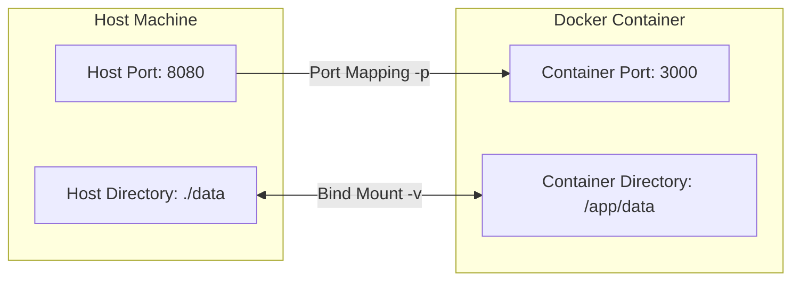

# Chapter 2.5 - Interacting with the container via volumes and ports

## Overview

This section introduces two fundamental mechanisms for communicating with running containers: Volumes (for persisting files and sharing data) and Ports (for enabling network traffic). These concepts bridge the gap between heavily isolated containers and your local host machine.

---

## Learning Objectives

After completing this section, you should be able to:

* Use bind mounts to persist container data on the host machine.
* Mount individual files or entire directories into a container.
* Understand the difference between "exposing" and "publishing" a port.
* Map host ports to container ports to enable external network access.
* Apply basic network security by binding ports strictly to localhost.

---

## Core Concepts

### Ephemeral Storage vs Bind Mounts

By default, a container's filesystem is ephemeral. If the container is deleted, all the data inside it is lost. 
**Bind mounts** solve this by mapping a file or directory from the host machine directly into the container. Any changes made by the container inside that mounted directory are saved directly to the host's hard drive, ensuring data persists beyond the container's lifecycle.

### Exposing vs Publishing Ports

Because containers are isolated, they have their own internal IP addresses and ports.
* **Exposing (`EXPOSE`)**: Using the `EXPOSE` instruction in a `Dockerfile` serves purely as documentation. It tells other developers which port the application listens on internally, but it does *not* automatically make the port accessible from your host machine.
* **Publishing (`-p`)**: Using the `-p` flag during `docker run` actually alters the network routing, mapping a port on your host machine to a specific port inside the container.

### Diagram: Host-Container Bridging



---

## Commands Learned

### CLI Commands

| Command | Purpose |
| ------- | ------- |
| `docker run -v <host-path>:<container-path> ...` | Mounts a host directory or file into the container. |
| `docker run -p <host-port>:<container-port> ...` | Publishes a container port, mapping it to a host port. |
| `docker run -p <container-port> ...` | Publishes a container port to a randomly assigned host port. |

### Dockerfile Instructions

| Instruction | Purpose |
| ----------- | ------- |
| `EXPOSE <port>` | Documents the port the application listens on. |

---

## Practical Examples

### Bind mounting a directory for data persistence

```bash
docker run -v "$(pwd):/mydir" my-downloader-image https://youtube.com/...
```
*Explanation: Maps the current working directory on the host (`$(pwd)`) to `/mydir` inside the container. When the container downloads a video to `/mydir`, the file is saved directly to your host machine.*

### Publishing a web server securely

```bash
docker run -p 127.0.0.1:8080:3000 my-web-app
```
*Explanation: Maps port `8080` on the host to port `3000` inside the container. Prepending `127.0.0.1` ensures that only your local computer can access the app, preventing anyone else on your network from reaching it.*

---

## Quick Revision

* Containers are isolated. Volumes/bind mounts bridge the filesystem gap; Ports bridge the network gap.
* `EXPOSE` = Documentation in the Dockerfile.
* `-p` = Actual networking configuration at runtime.
* Use `$(pwd)` (or `$PWD`) to cleanly reference the current directory for relative bind mounts.
* Bind mounting a non-existent file on the host will cause Docker to accidentally create an empty directory in its place.

---

## Interview Questions

### Q1. What happens to the data inside a container when the container is removed?

By default, the data is permanently lost because the container's filesystem is ephemeral. To persist data (like database records or downloaded files), you must use a volume or a bind mount to store the data safely on the host machine.

### Q2. What is the exact difference between `EXPOSE` in a Dockerfile and publishing with `-p`?

`EXPOSE` is an informational instruction in the Dockerfile indicating the port the application expects to use. It does not open the port to the host machine. Publishing with the `-p` runtime flag actively binds a host port to the container port, making it accessible from the outside.

### Q3. What is the security implication of running `docker run -p 8080:80`?

This maps the port to `0.0.0.0` by default, meaning the container is accessible to anyone who can reach your host machine's IP address on the broader network. For local development, it is safer to bind specifically to localhost: `-p 127.0.0.1:8080:80`.

---

## Common Mistakes

* **Accidental Directory Creation**: Trying to mount a specific file (e.g., `-v ./config.txt:/app/config.txt`) when `config.txt` does not actually exist on the host yet. Docker will assume you meant to create a directory and will create an empty folder named `config.txt`.
* **Assuming `EXPOSE` does the networking**: Writing `EXPOSE 8080` in a Dockerfile and wondering why `localhost:8080` refuses to connect in the browser. You still must use `-p 8080:8080` when starting the container.
* **Reversed `-p` syntax**: Typing `-p container-port:host-port` instead of the correct `-p host-port:container-port`. Always remember: outside first, inside second.

---

## References

* [MOOC.fi Course Material](https://courses.mooc.fi/org/uh-cs/courses/devops-with-docker-spring-2026/chapter-2/interacting-with-the-container-via-volumes-and-ports)
* [Docker Bind Mounts Documentation](https://docs.docker.com/storage/bind-mounts/)
* [Docker Networking Basics](https://docs.docker.com/network/)

---

## Key Takeaways

* Never store critical state inside a standard container filesystem without a volume/mount.
* Always explicitly secure your published ports by binding to `127.0.0.1` unless public access is strictly intended.
* Volumes and ports are the primary ways you make an isolated container useful to the outside world.
