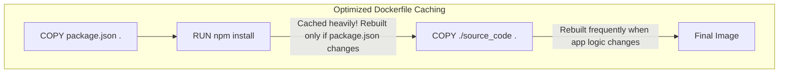

# Chapter 2.6 - Utilizing tools from the Registry

## Overview

This section covers how to leverage pre-built language images from Docker Hub to simplify containerization. It introduces critical Dockerfile caching techniques for dependency management and explains the workflow for publishing your own custom images to Docker Hub for cloud deployment.

---

## Learning Objectives

After completing this section, you should be able to:

- Translate a standard project README into a functional `Dockerfile`.
- Utilize pre-built runtime images (like Ruby, Python, or Node.js) instead of bare OS images.
- Optimize Dockerfile build times by strategically ordering `COPY` and `RUN` commands to cache dependencies.
- Authenticate, tag, and push a locally built image to a public Docker Hub repository.
- Understand how Apple Silicon (M-series) Macs can cause architecture mismatch errors during builds.

---

## Core Concepts

### Pre-built Language Images

Instead of using a base `ubuntu` image and writing complex `apt-get` scripts to install a programming language, Docker Hub provides official pre-built images. For example, starting with `FROM ruby:3.1` or `FROM node:20` immediately gives you a perfectly configured environment for that language, saving time and reducing image complexity.

### Dependency Layer Caching

The order of instructions in a `Dockerfile` matters immensely for build speed. If you copy your entire source code into the image before installing dependencies, Docker will invalidate the dependency cache every time you change a single line of code, forcing a full re-download of all packages.

**The Caching Trick**:
Copy _only_ the dependency manifest files (e.g., `package.json`, `Gemfile`, `requirements.txt`) first. Run the install command. _Then_ copy the rest of your source code. Docker will cache the heavy dependency layer and reuse it unless the manifest file itself changes.

### Docker Hub Namespaces

To push an image to Docker Hub, it must belong to a namespace you own. If your username is `johndoe`, you cannot push an image named `my-app`. It must be tagged as `johndoe/my-app`.

### Diagram: Optimized Caching Workflow



---

## Architecture / Workflow

### Publishing an Image to Docker Hub

1. **Login**: Authenticate your local Docker CLI with `docker login`.
2. **Build/Tag**: Build your image, then tag it to match your target Docker Hub repository using your username.
3. **Push**: Upload the image to the remote registry.

---

## Commands Learned

### CLI Commands

| Command                                   | Purpose                                                                       |
| ----------------------------------------- | ----------------------------------------------------------------------------- |
| `docker login`                            | Authenticates your local Docker CLI with a registry (defaults to Docker Hub). |
| `docker tag <old> <username>/<new>:<tag>` | Renames an image, preparing it to be pushed to a specific registry namespace. |
| `docker push <username>/<image>:<tag>`    | Uploads the image to the remote registry.                                     |

---

## Practical Examples

### Optimized Dependency Caching Pattern (Ruby Example)

```dockerfile
# 1. Use a pre-built language image
FROM ruby:3.1.0
WORKDIR /usr/src/app

# 2. Copy ONLY dependency files first
COPY Gemfile* ./

# 3. Install dependencies (This layer gets cached!)
RUN bundle install

# 4. Copy the rest of the application code
COPY . .

# 5. Run the app
CMD ["rails", "s", "-e", "production"]
```

### Tagging and Publishing to Docker Hub

```bash
# Assuming you built a local image named 'my-web-app'
# 1. Rename it to include your Docker Hub username (e.g., 'johndoe')
docker tag my-web-app johndoe/my-web-app:v1

# 2. Push it to Docker Hub
docker push johndoe/my-web-app:v1
```

---

## Quick Revision

- Always use pre-built language images (e.g., `FROM python:3.11`) instead of installing languages manually on `ubuntu`.
- To speed up builds, separate the copying of dependency manifests from the copying of the application source code.
- You cannot push an image named `my-app` directly to Docker Hub; it must be prefixed with your username: `username/my-app`.
- Deploying a containerized app to cloud providers (like Render or Fly.io) is usually as simple as pointing the service to your published Docker Hub image.

---

## Interview Questions

### Q1. How do you optimize a Dockerfile to avoid re-downloading npm/pip dependencies every time you change a line of application code?

Copy the `package.json` or `requirements.txt` file first, run the installation command, and _then_ copy the rest of the application code. Because Docker caches layers sequentially, this ensures the dependency installation layer is cached and only rebuilt if the dependency file itself is modified.

### Q2. What steps are required to publish a local Docker image to Docker Hub?

You must first authenticate using `docker login`, then use `docker tag` to prepend your Docker Hub username to the image name, and finally use `docker push` to upload it.

### Q3. Why might an image build fail on a modern Mac (Apple Silicon) but work perfectly on a Windows/Linux PC?

Modern Macs use ARM architecture (`arm64`), while most PCs use Intel/AMD (`x86_64`). If a project's dependency lockfile strictly requires an `x86_64` compiled binary, the build will fail on ARM unless you update the lockfile or force Docker to emulate `x86_64` using the `--platform linux/amd64` flag during the build.

---

## Common Mistakes

- **Poor Caching Strategy**: Writing `COPY . .` followed immediately by `RUN npm install`. This guarantees that `npm install` runs every single time you change a minor CSS or HTML file, making builds painfully slow.
- **Forgetting to Tag before Push**: Trying to run `docker push my-app` and receiving an "access denied" error because Docker is trying to push to the restricted official `library/my-app` namespace instead of your personal account.
- **Committing Secrets**: Accidentally copying `.env` files containing production passwords or API keys into the image during the `COPY . .` step, and then pushing that image publicly to Docker Hub. (Use a `.dockerignore` file to prevent this).

---

## References

- [MOOC.fi Course Material](https://courses.mooc.fi/org/uh-cs/courses/devops-with-docker-spring-2026/chapter-2/utilizing-tools-from-the-registry)
- [Docker Hub](https://hub.docker.com/)
- [Dockerfile Best Practices - Caching](https://docs.docker.com/develop/develop-images/dockerfile_best-practices/#leverage-build-cache)

---

## Key Takeaways

- Never reinvent the wheel: leverage official language images from Docker Hub.
- Dockerfile caching is the secret to fast deployment pipelines.
- Docker Hub is the central nervous system for sharing and deploying containerized applications.
