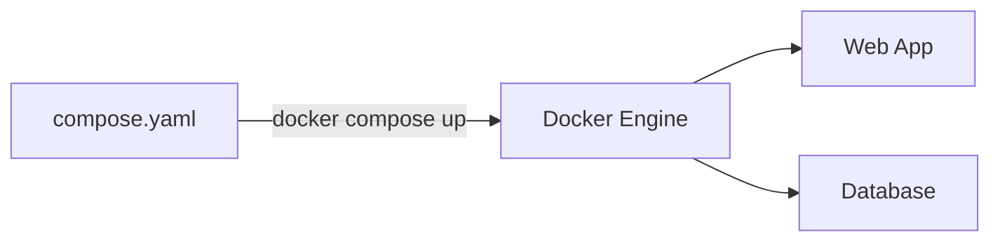

# Chapter 3.1 - Migrating to Docker Compose

## Overview

Docker Compose streamlines running applications by allowing users to manage configurations for multi-container workflows in a single YAML file. This replaces the need to execute long, complex `docker run` commands with multiple flags.

---

## Learning Objectives

After completing this section, you should be able to:

- Define and run multi-container applications using Docker Compose.
- Write a `docker-compose.yaml` (or `compose.yaml`) configuration file.
- Configure volumes, environment variables, and port mappings declaratively.
- Manage the lifecycle of services using the `docker compose` CLI.

---

## Core Concepts

### Definition

Docker Compose is a tool designed to define, manage, and run multi-container Docker applications using a structured YAML configuration file.

### Explanation

Instead of running individual `docker run` commands and manually stringing together `-p`, `-v`, and `-e` flags, you declare these settings inside a configuration file (like `compose.yaml`). You can then bring up, monitor, and tear down your entire application stack with a single command. 

Compose was previously a standalone utility (`docker-compose`), but it is now fully integrated into the Docker CLI as `docker compose`.

### Examples

A simple configuration mapping a port for a web service:

```yaml
services:
  whoami:
    image: jwilder/whoami
    ports:
      - 8000:8000
```

### Diagrams

> Architecture of running multi-container applications with Docker Compose



---

## Architecture / Workflow

### Workflow Steps

1. Define your application's environment with a `Dockerfile` if you need to build custom images.
2. Define the services that make up your application stack in `compose.yaml`.
3. Run `docker compose up` to start all your defined services simultaneously.

---

## Commands Learned

```bash
# Start all services
docker compose up

# Stop and remove all services
docker compose down
```

### Command Reference

| Command | Purpose |
| ------- | ----------- |
| `docker compose up` | Starts all services defined in the configuration file. |
| `docker compose up -d` | Starts services in the background (detached mode). |
| `docker compose down` | Stops and removes running services, networks, and containers. |
| `docker compose build` | Builds images for services that have the `build` key defined. |
| `docker compose push` | Pushes locally built images for services to a container registry. |
| `docker compose run <service>` | Runs a one-off command for a specific service. |
| `docker compose logs` | Views the logs from the running containers. |
| `docker compose ps` | Lists all services and their current status. |

---

## Practical Examples

### Example 1: Building an Image and Mounting a Volume

```yaml
services:
  yt-dlp-ubuntu:
    image: myuser/myimage
    build: .
    volumes:
      - .:/mydir
    container_name: yt-dlp
```

You can start the specific service and pass arguments using the `run` command:

```bash
docker compose run yt-dlp-ubuntu https://www.youtube.com/watch?v=saEpkcVi1d4
```

### Example 2: Passing Environment Variables

```yaml
services:
  backend:
    image: my-backend-image
    environment:
      - VARIABLE=VALUE
      - VARIABLE2=VALUE2
```

---

## Quick Revision

- `compose.yaml` is the preferred modern standard naming convention, though `docker-compose.yaml` is widely used.
- The `build` key specifies the context path to the `Dockerfile`.
- Volume bind mounts use the syntax `host_location:container_location` (e.g. `.:/mydir`).
- Compose is integrated directly into Docker CLI, meaning you should use `docker compose` with a space.

---

## Interview Questions

### Q1. What is the difference between `docker-compose.yaml` and `compose.yaml`?

Both are acceptable file names for a Docker Compose project, but the official Docker documentation prefers `compose.yaml` as the newer standard naming convention.

### Q2. What is the difference between `docker compose` and `docker-compose`?

`docker-compose` (with a hyphen) was the original, standalone V1 utility. It is now deprecated. `docker compose` (with a space) is the V2 implementation, fully integrated natively into the Docker CLI.

### Q3. How do you map a local directory to a container in a Compose file?

By using the `volumes` key under the service definition, following the syntax `host_path:container_path` (e.g., `.:/mydir`).

---

## Common Mistakes

- **Formatting errors**: Misindenting the YAML file. YAML relies on strict indentation (spaces, not tabs).
- **Blocking the terminal**: Forgetting to use the `-d` flag with `docker compose up`, causing the terminal session to be blocked by the container logs.
- **Image vs. Build confusion**: Confusing the `image` key (which names the image to pull or name the built image) with the `build` key (which specifies the context directory to build the image from).

---

## References

- [MOOC.fi Course Material: Migrating to Docker Compose](https://courses.mooc.fi/org/uh-cs/courses/devops-with-docker-spring-2026/chapter-3/migrating-to-docker-compose)
- [Docker Compose Documentation](https://docs.docker.com/compose/)

---

## Key Takeaways

- Docker Compose massively simplifies running applications that require multiple containers.
- A single YAML file replaces complex and error-prone `docker run` shell commands.
- It is possible to map ports, define volumes, set environment variables, and configure custom builds natively within the compose file.
