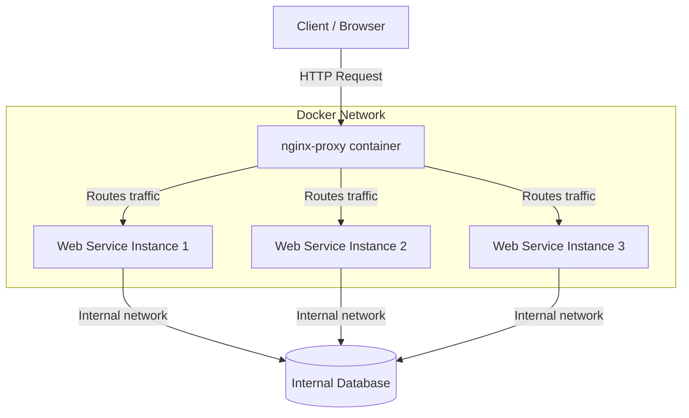

# Chapter 3.2 - Docker Networking

## Overview

When developing multi-container applications, services need a secure and reliable way to communicate. Docker Compose simplifies this by automatically handling network creation and DNS resolution. This section covers how Compose networking works by default, how to configure networks manually, and how to scale services behind a load balancer to handle traffic efficiently.

---

## Learning Objectives

After completing this section, you should be able to:

- Understand how Docker Compose creates default networks and handles internal DNS resolution.
- Define custom networks and connect to external networks within a `compose.yaml` file.
- Scale services using the Compose CLI without encountering port clashes.
- Deploy a reverse proxy (like `nginx-proxy`) to load balance traffic across scaled container instances.

---

## Core Concepts

### Default Networking & Internal DNS

By default, when you run `docker compose up`, Docker Compose creates a single bridge network for your application. Every service defined in the compose file joins this network. Crucially, Docker provides an internal DNS server that allows containers to discover each other using their **service names** as hostnames. 

Because of this, you do not need to publish internal service ports (like a database port) to the host machine. The backend can simply talk to the database securely within the isolated network.

### Custom and External Networks

You can explicitly define networks in your compose file. This is particularly useful when you want containers from different Compose projects to interact. By declaring a network as `external`, you tell Compose to connect the service to a network that was already created elsewhere.

### Scaling & Load Balancing

Compose allows you to run multiple instances of a single service. However, if your service binds to a specific host port (e.g., `8000:8000`), scaling will fail because multiple containers cannot bind to the exact same host port. By omitting the host port mapping (e.g., just `8000`), Docker dynamically assigns a random free host port to each instance. A reverse proxy is then typically placed in front of these instances to act as a single entry point, routing traffic to the dynamically assigned containers.

---

## Architecture / Workflow

### Diagram: Scaled Web Services behind a Reverse Proxy



---

## Commands Learned

### Command Reference

| Command | Purpose |
| ------- | ----------- |
| `docker compose up --scale <service>=<n>` | Starts `<n>` number of instances for the specified `<service>`. |
| `docker compose port --index <n> <service> <port>` | Prints the public-facing (host) port that instance `<n>` of `<service>` is bound to. |

---

## Practical Examples

### Example 1: Connecting to an External Network

To connect a service to an existing network (e.g., `the-database-network`) created by another Compose project:

```yaml
services:
  db:
    image: backend-image
    networks:
      - database-network

networks:
  database-network:
    external:
      name: the-database-network # Must match the actual existing network name
```

### Example 2: Scaling with Nginx-Proxy

Using `jwilder/nginx-proxy` to route traffic based on the `VIRTUAL_HOST` environment variable. The proxy monitors the Docker socket to automatically detect when new scaled containers start or stop.

```yaml
services:
  whoami:
    image: jwilder/whoami
    environment:
      - VIRTUAL_HOST=whoami.colasloth.com # Used by the proxy for routing
    # Notice no 'ports' mapping here to avoid clashes during scaling

  proxy:
    image: jwilder/nginx-proxy
    volumes:
      - /var/run/docker.sock:/tmp/docker.sock:ro # Mount the Docker socket
    ports:
      - 80:80
```

*Start 3 instances:*
```bash
docker compose up -d --scale whoami=3
```

---

## Quick Revision

- Services in the same `compose.yaml` can communicate via their service names (e.g., `http://backend:8080`).
- **Security Rule:** Never map ports to the host machine for internal services (like Redis or PostgreSQL) unless you specifically need external access for debugging.
- To scale a service, you must either remove the port mapping entirely or omit the host side of the mapping to allow Docker to assign random ports.
- Load balancers (like `nginx-proxy`) need access to `/var/run/docker.sock` to dynamically read routing information from running containers.

---

## Interview Questions

### Q1. How do containers in a Docker Compose file communicate with each other?
By default, Docker Compose places all services in a single bridge network and provides internal DNS resolution. Containers can communicate with each other by making requests to the service names defined in the YAML file.

### Q2. If you want to scale a web service to 5 instances using `docker compose up --scale`, what configuration change is mandatory regarding ports?
You must remove the hardcoded host port binding (e.g., change `8080:80` to just `80`). Otherwise, the first instance will bind to the host port, and instances 2 through 5 will crash with a "port already in use" error.

### Q3. Why does a containerized reverse proxy often require a volume mount for `/var/run/docker.sock`?
Mounting the Docker socket allows the proxy container to communicate directly with the Docker Daemon. This enables it to listen for Docker events (like containers starting or stopping) and dynamically reconfigure its routing tables based on container environment variables and internal IP addresses.

---

## Common Mistakes

- **Exposing Internal Databases:** Mapping database ports (e.g., `5432:5432` for Postgres) to the host in a production setup, unintentionally exposing the database to the public internet.
- **Hardcoding IPs:** Trying to connect services using static internal IP addresses instead of relying on Docker's built-in DNS and service names.
- **Port Clashes:** Forgetting to adjust port configurations before attempting to use the `--scale` flag.

---

## References

- [MOOC.fi Course Material: Docker Networking](https://courses.mooc.fi/org/uh-cs/courses/devops-with-docker-spring-2026/chapter-3/docker-networking)
- [Docker Compose Networking Documentation](https://docs.docker.com/compose/networking/)

---

## Key Takeaways

- Networking in Compose is primarily automatic and invisible, relying on DNS resolution of service names.
- Scaling compute resources locally is trivial with Compose, provided port bindings are managed dynamically.
- Complex local setups can mimic production environments by utilizing reverse proxies to distribute incoming traffic to scaled worker containers.
