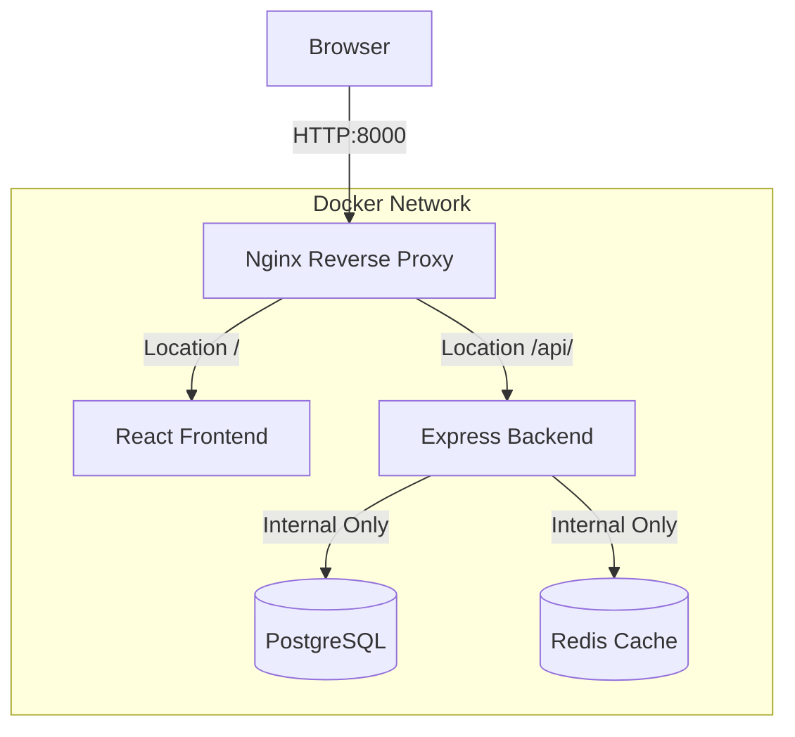

# Chapter 3.3 - Volumes in Action

## Overview

This section demonstrates how to handle persistent data efficiently using Docker managed volumes in a multi-container stack. It also covers service startup dependencies, configuring Nginx as a reverse proxy, and securing application networks by properly managing published ports.

---

## Learning Objectives

After completing this section, you should be able to:

- Distinguish between anonymous volumes, named volumes, and bind mounts.
- Configure and manage explicit "named" volumes within a `compose.yaml` file.
- Use `depends_on` to control the startup order of your services.
- Configure Nginx as a reverse proxy to handle traffic routing.
- Audit your exposed ports to prevent accidental data leaks (e.g., leaving database ports open to the public).

---

## Core Concepts

### Docker Managed Volumes

Docker managed volumes are storage locations completely managed by Docker, typically stored inside `/var/lib/docker/volumes/` on the host machine. 
- **Anonymous Volumes:** If a `Dockerfile` defines a `VOLUME` instruction, but you do not map it in your `compose.yaml`, Docker automatically creates a volume with a long, randomized hash name. These are difficult to identify and manage.
- **Named Volumes:** Defined explicitly under the `volumes:` block in `compose.yaml`. Docker prepends the project name to your chosen name (e.g., `redmine_database`), making it highly readable and reusable.

### Service Dependencies

The `depends_on` key controls the order in which services start and stop. For instance, a web app might depend on a database. However, `depends_on` only waits for the dependent *container* to start—it does not wait for the application *inside* the container (like Postgres) to finish booting and become ready to accept connections.

### Reverse Proxy

A reverse proxy retrieves resources on behalf of a client from one or more internal servers. In a Docker Compose stack, an Nginx container can act as the sole public-facing service (listening on port 80), routing requests like `/api/` to the backend service and everything else (`/`) to the frontend service.

---

## Architecture / Workflow

### Workflow Steps: Reverse Proxy

1. The client requests `http://localhost:8000/api/ping`.
2. The request hits the Nginx container (which has port 8000 mapped to its internal port 80).
3. Nginx reads its `nginx.conf` and sees that `/api/` requests should be forwarded to the `backend` service.
4. The backend processes the request and sends the response back through Nginx to the client.

### Diagrams

> Single point of entry using a Reverse Proxy



---

## Commands Learned

### Command Reference

| Command | Purpose |
| ------- | ----------- |
| `docker volume ls` | Lists all volumes currently managed by Docker. |
| `docker volume prune` | Deletes all unused (unattached) volumes. Useful for cleaning up anonymous volumes. |
| `docker container diff <container>` | Shows changes made to the container's filesystem since it was started. |
| `docker container exec -it <container> <cmd>` | Executes an interactive command inside a running container (e.g., `psql` or `bash`). |

---

## Practical Examples

### Example 1: Defining a Named Volume

Instead of relying on an anonymous volume, explicitly declare it:

```yaml
services:
  db:
    image: postgres:18
    volumes:
      - database:/var/lib/postgresql # Mapping to a named volume
    
volumes:
  database: # Explicitly defining the named volume
```

### Example 2: Basic Nginx Reverse Proxy Configuration

A simple `nginx.conf` routing traffic internally without exposing the frontend or backend directly to the host machine:

```nginx
events { worker_connections 1024; }

http {
  server {
    listen 80;

    location / {
      proxy_pass http://frontend:3000;
    }

    location /api/ {
      proxy_pass http://backend:8080;
    }
  }
}
```

---

## Quick Revision

- **Restart Policies:** `restart: unless-stopped` is often preferred over `always`. It ensures the container restarts automatically (even after system reboots), *unless* you specifically manually stopped it.
- **Port Security:** Do NOT map ports (e.g., `ports: - 5432:5432`) for internal databases. This exposes them to the host network. Keep them closed, relying on internal Docker DNS for service-to-service communication.
- **Volume Selection:** Use bind mounts (`.:/app`) when you need to edit source code live. Use named Docker volumes (`data:/var/lib/postgresql`) when you want Docker to safely persist application state or databases.

---

## Interview Questions

### Q1. What is the difference between an anonymous volume and a named volume?

An anonymous volume is created automatically by Docker when a `VOLUME` instruction exists in a container image but is not explicitly mapped in the run command or compose file; it receives a randomized hash for a name. A named volume is explicitly declared by the user, given a readable name, and is much easier to manage, backup, and attach to multiple containers.

### Q2. Does `depends_on` ensure that your database is fully ready to accept queries?

No. `depends_on` only ensures the *container* has started before the dependent service starts. It does not verify the internal application state. The dependent service must still handle database connection retries (or use a `healthcheck`) if the database takes longer to boot.

### Q3. Why use a reverse proxy in a multi-container application?

It provides a single entry point to the application, eliminating the need to expose multiple ports to the host machine. It also simplifies client-side logic by routing traffic based on URL paths (e.g., separating frontend and API traffic) and can handle TLS termination or load balancing.

---

## Common Mistakes

- **Forgetting the trailing slash in Nginx:** When configuring Nginx, omitting trailing slashes in `location /api/` can cause routing misconfigurations.
- **Over-publishing Ports:** Publishing backend or database ports out of habit. You should use tools like `nmap localhost` to verify that only intended ports (like the proxy's port 80) are visible to the host.
- **Ignoring Anonymous Volumes:** Leaving behind gigabytes of old anonymous database volumes because `docker rm` was used without the `-v` flag, or `docker volume prune` was forgotten.

---

## References

- [MOOC.fi Course Material: Volumes in action](https://courses.mooc.fi/org/uh-cs/courses/devops-with-docker-spring-2026/chapter-3/volumes-in-action)
- [Docker Documentation: Use volumes](https://docs.docker.com/storage/volumes/)

---

## Key Takeaways

- Properly naming your volumes prevents data loss and makes your Compose configuration self-documenting.
- Managing networking safely involves only exposing the absolute minimum necessary ports (usually just the reverse proxy) to the host.
- Nginx provides a robust, lightweight solution for tying frontend and backend container services together under a single cohesive URL structure.
