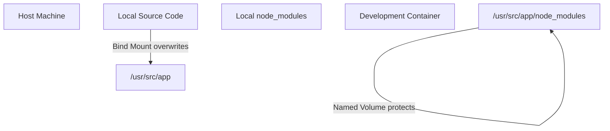

# Chapter 3.4 - Containers in Development

## Overview

While containers are heavily utilized in production, they are equally powerful for local development. This section explores how to leverage Docker to create isolated, consistent, and easily shareable development environments. Using containers locally completely eliminates the classic "works-on-my-machine" problem and massively accelerates developer onboarding.

---

## Learning Objectives

After completing this section, you should be able to:

- Articulate the benefits of containerizing a local development environment.
- Configure a `compose.yaml` file optimized for live coding and hot-reloading.
- Combine bind mounts with named volumes to prevent host directories from overwriting critical container dependencies.
- Troubleshoot common file-watching issues (especially in WSL 2 environments).

---

## Core Concepts

### Containerized Development Environments

A containerized development setup means that the host machine requires zero application dependencies. No NodeJS, no Python, no local PostgreSQL installations are needed. A new developer joining a project simply needs to install Docker, clone the repository, and run `docker compose up`. 

### Hot Reloading via Bind Mounts

To write code efficiently, developers need instant feedback. By using a bind mount (`.:/usr/src/app`), the host machine's source code is directly injected into the container. When a developer saves a file in their local editor, the change is immediately visible inside the container, allowing tools like `nodemon` (for Node.js) to restart the process instantly.

### The "Volume Trick" for Dependencies

When you bind mount your entire local project directory to the container, it overwrites the container's directory. If you are developing on a Mac or Windows machine, but the container is Linux, your local `node_modules` folder might contain incompatible binaries, or it might be missing entirely. 

To solve this, you define a *second*, more specific volume mapping for the dependencies folder (e.g., `node_modules:/usr/src/app/node_modules`). Docker prioritizes the more specific path, ensuring the dependencies built natively inside the Linux container are preserved and used, ignoring the host's `node_modules`.

---

## Architecture / Workflow

### Workflow Steps: Live Development

1. Create a `Dockerfile` that installs dependencies and sets up a development watcher tool (like `nodemon`).
2. Create a `compose.yaml` that builds the image, sets the startup command, and defines the bind mounts.
3. Run `docker compose up`.
4. Edit files locally in your favorite IDE. The container instantly detects the changes and reloads the application.

### Diagrams

> How bind mounts and specific named volumes interact in development



---

## Commands Learned

### Command Reference

| Command | Purpose |
| ------- | ----------- |
| `docker compose up --build` | Forces a rebuild of the images before starting the containers. Crucial when application dependencies (like `package.json`) are modified. |

---

## Practical Examples

### Example 1: NodeJS Development `compose.yaml`

```yaml
services:
  node-dev-env:
    build: . 
    command: npm start # e.g., starts 'nodemon index.js'
    ports:
      - 3000:3000 
    volumes:
      # 1. Bind mount: syncs code for live-reloading
      - ./:/usr/src/app 
      # 2. Named volume: protects Linux-built dependencies
      - node_modules:/usr/src/app/node_modules 

volumes:
  node_modules: # Must be defined here to be used above
```

---

## Quick Revision

- Containers allow for instant spin-ups of specific database versions for local testing (e.g., `docker run -p 5656:27017 mongo:4.0.22`).
- Hot reloading is achieved by bind-mounting the source code directory.
- Use explicit volume declarations for dependency folders (like `node_modules` or `.venv`) to prevent the host system from corrupting the container's native binaries.

---

## Interview Questions

### Q1. What are the primary advantages of using Docker for local development?

It provides environment consistency across the entire team (eliminating "it works on my machine" bugs), removes the need to install language runtimes on host systems, dramatically speeds up developer onboarding, and makes it trivial to test against specific infrastructure versions (like older database engines).

### Q2. In a Docker Compose file, why might you map both `.:/app` and `node_modules:/app/node_modules` simultaneously?

The broad bind mount (`.:/app`) syncs your local code changes to the container to enable live reloading. However, it also overwrites everything in `/app`. The second mapping is a named volume targeting the `node_modules` folder specifically. Docker prioritizes the longer, more specific path. This ensures that the dependencies natively installed during the image build are protected and used, rather than whatever (potentially incompatible) dependencies exist on the host machine.

---

## Common Mistakes

- **Forgetting `--build`:** Modifying `package.json` to add a new library and running `docker compose up` without the `--build` flag. The container will fail because the new dependency isn't installed in the cached image.
- **WSL 2 Filesystem Watcher Failures:** Developing on Windows via WSL 2, but keeping the project files on the Windows `/mnt/c/` drive. Linux file-watching tools (like `nodemon`) cannot reliably detect save events across the OS boundary. Projects must be cloned directly into the Linux filesystem (e.g., `~/projects/`) for hot reloading to function.

---

## References

- [MOOC.fi Course Material: Containers in development](https://courses.mooc.fi/org/uh-cs/courses/devops-with-docker-spring-2026/chapter-3/containers-in-development)
- [Docker Documentation: Use bind mounts](https://docs.docker.com/storage/bind-mounts/)

---

## Key Takeaways

- Utilizing Docker natively for development removes friction, keeps host machines clean, and guarantees that the environment running on your laptop mirrors the one in production.
- Advanced volume configurations allow developers to enjoy the speed of local hot-reloading without sacrificing container isolation.
