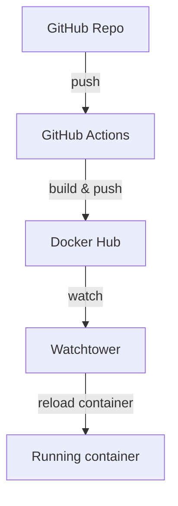

# Chapter 4.2 – Deployment Pipelines

## Overview
Deployment pipelines automate the process of moving code from a repository to a running application on a target host.  In this chapter we build a simple continuous‑integration/continuous‑deployment (CI/CD) flow that:

1. Builds a Docker image whenever a commit is pushed to **GitHub**.
2. Pushes the image to **Docker Hub**.
3. Uses **Watchtower** in a local machine (or a VM) to pull the new image and restart the running container automatically.

The example uses a small Node.js/Express app but can be adapted to any containerized service.

---

## Learning Objectives
After this section you should be able to:

- Configure a GitHub Actions workflow that builds and pushes a Docker image.
- Understand the role of Docker Buildx, login, and build‑push actions.
- Set up Watchtower to automatically keep a running container up‑to‑date.
- Troubleshoot common CI/CD pitfalls such as secret leakage and image tag misuse.
- Extend the pipeline to run on a cloud VM or Docker‑Compose environment.

---

## Core Concepts
### Definition
A **deployment pipeline** automates building, testing, and deploying application code, typically using CI tools (GitHub Actions, GitLab CI, etc.) and container registries.

### Explanation
1. **Continuous Integration** – automatically build and test code on each commit.
2. **Continuous Delivery** – automatically push the resulting image to a registry.
3. **Deployment** – a separate process (here Watchtower) pulls the new image and restarts the container.

### Examples
- GitHub Actions workflow file `main.yml`.
- Docker‑Compose file for Watchtower.

### Diagrams


---

## Architecture / Workflow
1. **Code commit** – developer pushes to `main`.
2. GitHub Actions workflow triggers:
   - Checkout code.
   - Set up `buildx` for multi‑arch builds.
   - Log in to Docker Hub using secrets.
   - Build image and push.
3. Watchtower (running on the target host) polls Docker Hub at an interval.
4. When a new tag is found, Watchtower pulls the image and restarts the container.
5. Client accesses the updated service.

### Workflow Steps
1. `actions/checkout` – get repo code.
2. `docker/setup-buildx-action` – enable multi‑architecture builds.
3. `docker/login-action` – authenticate to Docker Hub.
4. `docker/build-push-action` – build image on the runner and push to registry.

---

## Commands Learned
```bash
# View current image digests
sudo docker image ls --digests <repo>:<tag>

# Inspect a specific image
sudo docker image inspect <repo>:<tag>

# Pull a newer image manually
sudo docker pull <repo>:<tag>

# Restart container after Watchtower update
sudo docker container restart <container_name>
```

### Command Reference
| Command | Purpose |
|---------|---------|
| `docker buildx build` | Build multi‑platform images |
| `docker login` | Authenticate to a registry |
| `docker push` | Push image to registry |
| `docker run` | Start a container |

---

## Practical Examples
### Example 1 – GitHub Actions workflow file
```yaml
name: Build and Push Docker Image
on:
  push:
    branches: [main]
jobs:
  build:
    runs-on: ubuntu-latest
    steps:
      - uses: actions/checkout@v5
      - uses: docker/setup-buildx-action@v3
      - uses: docker/login-action@v3
        with:
          username: ${{ secrets.DOCKER_USERNAME }}
          password: ${{ secrets.DOCKER_PASSWORD }}
      - uses: docker/build-push-action@v6
        with:
          context: .
          push: true
          tags: ${{ secrets.DOCKER_USERNAME }}/beermapping:latest
```

### Example 2 – Watchtower Docker‑Compose snippet
```yaml
services:
  watchtower:
    image: nickfedor/watchtower
    environment:
      - WATCHTOWER_POLL_INTERVAL=60
    volumes:
      - /var/run/docker.sock:/var/run/docker.sock
    container_name: watchtower
```

---

## Quick Revision
- **CI/CD** = automation pipeline for build → push → deploy.
- GitHub Actions is the first half; Watchtower is the runtime updater.
- Secrets are stored in GitHub repo settings – never hard‑code credentials.
- Use `buildx` for multi‑arch images, especially on ARM Macs.
- Always tag images (e.g., `_latest`), but do **not** rely on `latest` for production.

---

## Interview Questions
### Q1. What is the purpose of Docker Buildx in a CI workflow?
**Answer:** Buildx creates images for multiple CPU architectures (amd64, arm64, etc.) in a single build command, ensuring the image runs on any target machine.

### Q2. Why should secrets be stored in GitHub Actions and not in the repository source?
**Answer:** Secrets configured in the repository settings are encrypted and only exposed to the workflow runtime, protecting credentials from accidental leaks.

### Q3. How does Watchtower decide when to pull a new image?
**Answer:** By default it polls the registry every `WATCHTOWER_POLL_INTERVAL` seconds and triggers a pull if the image tag or digest has changed.

---

## Common Mistakes
- Forgetting to add Docker Hub credentials as repository secrets.
- Using `latest` as the tag in production; better to use immutable semver tags.
- Not exposing the Docker socket to Watchtower, causing it to be unable to restart containers.
- Using an old version of `docker/login-action`, leading to authentication errors.
- Not running the pipeline on a private repo when secrets are needed, causing a permissions error.

---

## References
- [MOOC.fi Course Material: Deployment Pipelines](https://courses.mooc.fi/org/uh-cs/courses/devops-with-docker-spring-2026/chapter-4/deployment-pipelines)
- [GitHub Actions Docs – Workflows](https://docs.github.com/en/actions)
- [Docker Official Buildx](https://docs.docker.com/buildx/)
- [Watchtower GitHub Repository](https://github.com/containrrr/watchtower)
- [Docker Hub Auth](https://docs.docker.com/docker-hub/)

---

## Key Takeaways
- A deployment pipeline turns code commits into runtime revisions automatically.
- GitHub Actions handles build & push; Watchtower handles pull & restart.
- Keep your images and secrets secure; use tags thoughtfully.
- Multi‑arch builds are essential for modern development (ARM, AMD).
- The same setup can be adapted to cloud VMs or Kubernetes with minimal changes.
