# Chapter 4.3 - Using a non-root user

## Overview

This section covers one of the most critical security practices in Docker: running container processes as an unprivileged (non-root) user. By default, Docker runs applications as the root user. If an attacker discovers a vulnerability and compromises the application, they gain root access inside the container, significantly increasing the risk of a container escape.

---

## Learning Objectives

After completing this section, you should be able to:

- Understand the security risks of running containers as root.
- Create new, unprivileged users inside a Docker container.
- Manage file and directory permissions using `chown`.
- Switch the active user context in a Dockerfile using the `USER` directive.

---

## Core Concepts

### Definition

**Non-root User**: A standard system user created specifically to run an application, possessing only the minimum permissions necessary to execute the task.

**USER Directive**: A Dockerfile instruction that sets the active user name (or UID) and optionally the user group (or GID) for any subsequent `RUN`, `CMD`, or `ENTRYPOINT` instructions that follow it.

### Explanation

Containers run in isolated environments, but they still share the host system's kernel. If a containerized application runs as `root` and is compromised, a bug in Docker or the Linux kernel could allow the attacker to "break out" of the container and gain root access to the host machine itself. 

To mitigate this, we manually create a standard user inside our Dockerfile, explicitly grant that user ownership over the necessary application files, and switch over to that user before starting the application. 

### Examples

If you have a backend web server that only needs to read incoming HTTP requests and write logs to a specific folder, it does not need root privileges. Creating an `appuser` limits the potential damage if the web server is hacked.

### Diagrams

```mermaid
graph TD
    subgraph Insecure Dockerfile
        A[Start as root] --> B[Install dependencies]
        B --> C[Copy App]
        C --> D[CMD: Run App as root]
        style D fill:#f8cecc,stroke:#b85450,stroke-width:2px,color:#000
    end
    
    subgraph Secure Dockerfile
        E[Start as root] --> F[Install dependencies]
        F --> G[Copy App & Create User]
        G --> H[chown App Directory]
        H --> I[USER appuser]
        I --> J[CMD: Run App as appuser]
        style J fill:#d5e8d4,stroke:#82b366,stroke-width:2px,color:#000
    end
```



---

## Architecture / Workflow

### Workflow Steps for Securing a Container

1. **Install Dependencies:** Start the Dockerfile as the default root user so you have permission to use package managers (like `apt-get` or `apk`).
2. **Create a User:** Use Linux commands to create a new user (e.g., `useradd -m appuser`).
3. **Set Ownership:** Use `chown` to grant the new user permissions to read and write in the application's working directory.
4. **Switch Context:** Use the `USER` Dockerfile directive to drop root privileges.
5. **Run Application:** The final `CMD` or `ENTRYPOINT` will now safely execute under the limited permissions of the new user.

---

## Commands Learned

```bash
# Create a new user with a home directory
useradd -m appuser

# Change the ownership of a directory to the new user
chown -R appuser:appuser /path/to/dir
```

### Command Reference

| Command | Purpose     |
| ------- | ----------- |
| `useradd -m <name>` | Creates a new user in Debian/Ubuntu-based images. The `-m` flag creates a home directory. |
| `adduser -D <name>` | Creates a new user in Alpine-based images without assigning a password. |
| `chown <user> <path>` | Changes the owner of a file or directory to the specified user. |
| `USER <name>` | Dockerfile instruction that switches the active user context from root to the specified user. |

---

## Practical Examples

### Example 1: Fixing Permission Denied Errors

If you switch to a non-root user without explicitly granting them access to the working directory, your application will crash when it tries to write files.

**Incorrect Implementation (Will fail):**
```dockerfile
FROM ubuntu:24.04
WORKDIR /mydir
RUN useradd -m appuser
USER appuser
# The application will crash with "Permission denied" when it tries to save a file to /mydir
ENTRYPOINT ["/usr/local/bin/yt-dlp"] 
```

**Correct Implementation:**
```dockerfile
FROM ubuntu:24.04
WORKDIR /mydir

# 1. Create the user
RUN useradd -m appuser

# 2. Change owner of the current directory (/mydir) so appuser can write to it
RUN chown appuser .

# 3. Drop privileges by switching to appuser
USER appuser

ENTRYPOINT ["/usr/local/bin/yt-dlp"]
```

---

## Quick Revision

- Always run containers as a non-root user whenever possible.
- Creating a user and changing ownership must be done *while you are still root*.
- The `USER` directive affects all instructions that come *after* it.
- If your application throws `[Errno 13] Permission denied`, it means your non-root user lacks ownership or write permissions for the directory it is trying to access.

---

## Interview Questions

### Q1. Why is it a bad practice to run Docker containers as root?

If an attacker compromises an application running as root inside a container, they possess root privileges within that environment. If a vulnerability exists in the container runtime or the Linux kernel, they can use those root privileges to perform a "container breakout" and take full control of the underlying host machine.

### Q2. Does the `USER` directive affect the `COPY` instruction?

No, standard `COPY` instructions will still copy files into the container as `root`. If you want to copy files and assign them to your new user in one step, you must use the `--chown` flag, like this: `COPY --chown=appuser:appuser . .`

### Q3. What is User Namespace Remapping?

User Namespace Remapping is an advanced Docker daemon security feature. It maps the root user inside a container to a high, non-existent, unprivileged user ID on the host machine. This means the application *thinks* it has root access inside the container, but on the actual host, it has zero privileges.

---

## Common Mistakes

- **Switching contexts too early:** Putting `USER appuser` at the top of the Dockerfile, and then trying to run `apt-get install`. The installation will fail because `appuser` doesn't have root permissions to install software.
- **Forgetting `chown`:** Creating a user and switching to them, but leaving the application directory owned by root. The application will immediately crash on startup when it tries to write logs or temporary files.
- **Using the wrong user creation command:** Trying to use `useradd` inside an Alpine Linux image. Alpine uses `adduser -D` instead.

---

## References

- [MOOC.fi Course Material: Using a non-root user](https://courses.mooc.fi/org/uh-cs/courses/devops-with-docker-spring-2026/chapter-4/using-a-non-root-user)
- [Docker Documentation: USER instruction](https://docs.docker.com/engine/reference/builder/#user)
- [Docker Security: Isolate containers with a user namespace](https://docs.docker.com/engine/security/userns-remap/)

---

## Key Takeaways

- Running processes as root is the default in Docker, but it is a major security flaw.
- Securing a Dockerfile is a 3-step process: Create the user, grant permissions, and switch context.
- Proper ordering in a Dockerfile is paramount for security and functionality.
