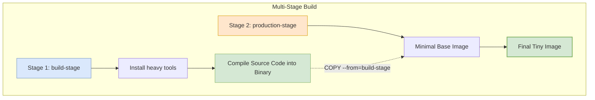

# Chapter 4.4 - Optimizing the image size

## Overview

This section covers the importance of reducing the size of Docker images and the techniques used to achieve this. Smaller images pull faster from registries, consume less storage, reduce network overhead, and most importantly, have a smaller surface area for security attacks.

---

## Learning Objectives

After completing this section, you should be able to:

- Understand how Docker layers work and how they contribute to image size.
- Optimize Dockerfiles by chaining `RUN` commands and cleaning up temporary caches.
- Select minimal base images (like Alpine Linux) to drastically reduce initial image footprints.
- Utilize pre-built language environments instead of manual installations.
- Implement multi-stage builds to completely strip build tools out of final production images.

---

## Core Concepts

### Definition

**Docker Layer**: Each instruction in a Dockerfile (such as `RUN`, `COPY`, `ADD`) creates an immutable layer. The final Docker image is the combination of all these stacked intermediate layers.

**Multi-stage Build**: A method of using multiple `FROM` statements in a single Dockerfile. It allows you to build an application in a heavy "builder" environment, and then selectively copy only the compiled artifacts into a fresh, minimal production image, discarding all the build tools.

### Explanation

When you install a package in a Dockerfile, the downloaded package and the temporary files it created are permanently baked into that layer. Even if you run a separate `RUN rm -rf ...` command on the next line, the overall image size won't shrink because the previous layer still contains those files. To fix this, you must download, install, and clean up all within a single `RUN` command.

Furthermore, standard base images like Ubuntu contain hundreds of megabytes of standard Linux utilities that your application likely doesn't need. Switching to lightweight Linux distributions like Alpine, or using Multi-stage builds to drop build environments completely, can reduce image sizes from Gigabytes down to Megabytes.

### Examples

If you compile a Go application, you need the heavy Go compiler and standard libraries. However, the final output is just a single executable binary. By using a multi-stage build, you can compile the binary in the heavy Go image, and then copy just the executable into an empty `scratch` image.

### Diagrams



---

## Architecture / Workflow

### Workflow Steps for Optimizing an Image

1. **Chain Commands:** Combine multiple `RUN` instructions into a single layer using `&& \`.
2. **Clean Caches:** Delete package manager caches (like `/var/lib/apt/lists/*`) at the very end of your chained `RUN` command.
3. **Change Base Image:** Swap large generic images (like `ubuntu`) for lightweight variants (like `alpine` or `python:alpine`).
4. **Implement Multi-stage:** If compiling code or building static frontend assets, introduce an `AS build-stage` alias and copy only the final assets to a fresh `FROM` image.

---

## Commands Learned

```bash
# View the size of individual layers in an image
docker image history <image_name>
```

### Command Reference

| Command / Syntax | Purpose |
| ---------------- | ------- |
| `docker image history` | Shows the chronological layers of an image and the exact size (in MB) each layer adds. |
| `FROM <image> AS <name>` | Assigns a name to a build stage, allowing you to reference it later in the Dockerfile. |
| `COPY --from=<name>` | Copies files from a previous build stage into the current stage, ignoring all other files. |
| `FROM scratch` | An explicitly empty base image in Docker, perfect for statically compiled binaries. |

---

## Practical Examples

### Example 1: Chaining RUN commands

**Bad (Creates multiple layers):**
```dockerfile
RUN apt-get update
RUN apt-get install -y curl
RUN rm -rf /var/lib/apt/lists/*
```

**Good (Creates one optimized layer):**
```dockerfile
RUN apt-get update && \
    apt-get install -y --no-install-recommends curl && \
    rm -rf /var/lib/apt/lists/*
```

### Example 2: Multi-stage Build for a Frontend

```dockerfile
# Stage 1: Build the assets
FROM node:16-alpine AS build-stage
WORKDIR /app
COPY . .
RUN npm install && npm run build

# Stage 2: Serve the assets
FROM nginx:alpine
COPY --from=build-stage /app/build /usr/share/nginx/html
# The final image size is only Nginx + static files. Node.js is completely discarded.
```

---

## Quick Revision

- Every instruction in a Dockerfile creates a permanent layer.
- Deleting a file in a later layer does *not* reduce the image size, it simply hides the file. Cleanups must happen in the same `RUN` command that created the files.
- `alpine` images use `apk` instead of `apt-get`, and rely on `musl` instead of `glibc`.
- Multi-stage builds are the most effective way to eliminate build dependencies (like compilers, Webpack, or Node modules) from production deployments.

---

## Interview Questions

### Q1. Why is having a smaller Docker image important?
Smaller images pull and deploy much faster, reducing startup times in CI/CD pipelines and orchestrators like Kubernetes. They also save on cloud storage costs and significantly reduce the security attack surface by limiting the number of available tools and libraries a hacker could exploit.

### Q2. How does a multi-stage build actually reduce image size?
A multi-stage build uses multiple `FROM` instructions. Docker builds the intermediate stages, but only the layers from the *final* `FROM` instruction are included in the final image. By copying only the compiled artifacts (`COPY --from=build-stage`) into the final stage, all the heavy compilers and source code from the previous stages are left behind and discarded.

### Q3. What is the `scratch` image?
`scratch` is Docker's reserved, explicitly empty image. It contains no folders, no shell, and no operating system. It is heavily used in the Go and C++ communities to host completely self-contained, statically compiled binaries, resulting in the smallest and most secure images possible.

---

## Common Mistakes

- **Forgetting the line continuation character (`\`):** When chaining commands, forgetting the backslash will cause Docker to execute only the first line and throw an error on the next.
- **Copying the whole project in a multi-stage build:** If you use `COPY --from=build-stage . .`, you defeat the purpose of the multi-stage build by bringing all the raw source code and build tools into the final image. You must only copy the specific output folder (e.g., `build/` or `dist/`).
- **Assuming Alpine runs everything:** Alpine uses `musl` instead of standard `glibc`. Some C-based Python libraries or older binary software may crash or fail to compile on Alpine without additional compatibility packages.

---

## References

- [MOOC.fi Course Material: Optimizing the image size](https://courses.mooc.fi/org/uh-cs/courses/devops-with-docker-spring-2026/chapter-4/optimizing-the-image-size)
- [Docker Documentation: Multi-stage builds](https://docs.docker.com/build/building/multi-stage/)
- [Docker Documentation: Base Image 'scratch'](https://hub.docker.com/_/scratch)

---

## Key Takeaways

- Combine installation and cleanup commands into a single `RUN` layer to prevent cache files from bloating your image.
- Always opt for official, pre-installed language environments (like `python:3.12-alpine`) over manually installing runtimes via `apt-get`.
- Multi-stage builds are the definitive industry standard for deploying frontend applications (compiling via Node, serving via Nginx) and compiled languages (Go, Java, Rust).
