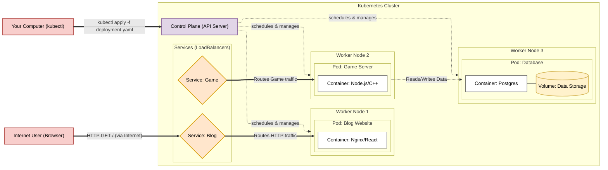

# Exercise 3.11: Kubernetes

## Objective

Understand and visualize the high-level architecture of a Kubernetes (K8s) cluster, focusing on the relationship between physical/virtual machines, logical application groupings, and network routing.

---

## Concepts Practiced

- Kubernetes Terminology (Nodes, Pods, Containers, Volumes, Services)
- Architectural Visualization
- Control Plane vs Worker Node responsibilities
- Internal and External Traffic Routing

---

## Exercise Summary

This exercise served as an introduction to Kubernetes by requiring the creation of an architectural diagram. Instead of a single host running a Docker Compose stack, a multi-host Kubernetes environment separates concerns across multiple machines. 

The diagram illustrates a cluster containing a **Control Plane** (the master node that manages the cluster state) and three **Worker Nodes** (the machines that actually run the applications). Two external applications are hosted: a Blog Website and a Game Server, alongside an internal Database.

The diagram specifically highlights how an external internet user does not connect directly to a container. Instead, traffic hits a **Service** (acting as a load balancer), which then seamlessly routes the HTTP request to the appropriate **Pod**. Meanwhile, developers interact solely with the Control Plane via `kubectl` to deploy applications, trusting the Control Plane to figure out which Worker Node has the capacity to schedule the new Pods.

---

## Architecture Diagram

Below is the conceptual architecture modeled for this exercise:

---

## Core Component Breakdown

- **Control Plane:** The "brain" of the cluster. It exposes the API that `kubectl` talks to, and it decides which nodes should run which pods.
- **Worker Node:** A physical or virtual server that actually runs the applications.
- **Pod:** The smallest deployable unit in Kubernetes. It usually contains one **Container**, but it can contain multiple tightly-coupled containers that need to share the same local network and storage.
- **Service:** A persistent, abstract network endpoint. Because Pods are mortal (they can crash and be rescheduled on different nodes with new IP addresses), a Service provides a stable IP address and load balances traffic to whatever healthy Pods currently exist.
- **Volume:** Persistent storage. If the Database Pod crashes and restarts on a different node, the volume ensures the data is not lost.

---

## Challenges Faced

- Differentiating between a Container and a Pod. Coming from pure Docker, it takes time to adjust to the fact that Kubernetes orchestrates Pods, not standalone containers.
- Visualizing how traffic enters the cluster. Understanding that Services sit "in front" of Pods to abstract away their ephemeral nature is crucial.

---

## Lessons Learned

- Kubernetes is fundamentally a declarative system. You (the developer) do not tell Worker Node 1 to run a container. You tell the Control Plane your desired state (e.g., "I want 3 instances of my Blog running"), and the Control Plane continuously works to make that state a reality across available nodes.
- Services are absolutely essential for both internal and external communication. Without them, applications would lose track of each other every time a Pod is recreated.

---

## Related Concepts

- Kubernetes Ingress Controllers
- Deployments vs StatefulSets
- Persistent Volume Claims (PVCs)

---

## References

- [MOOC.fi Exercise Page](https://courses.mooc.fi/org/uh-cs/courses/devops-with-docker-spring-2026/chapter-4/multi-host-environments#4a5e9d68-3107-5fa3-ad33-552142ee22f4)
- [Kubernetes Official Glossary](https://kubernetes.io/docs/reference/glossary/?all=true)
- [Kubernetes Components Documentation](https://kubernetes.io/docs/concepts/overview/components/)

---

## Completion Notes

Drawing out the architecture is the best way to demystify Kubernetes. While the terminology is initially overwhelming compared to a simple `docker-compose.yml`, seeing it visually mapped out makes it clear why these abstractions (like Services and Pods) are necessary for running highly available systems across multiple machines.
