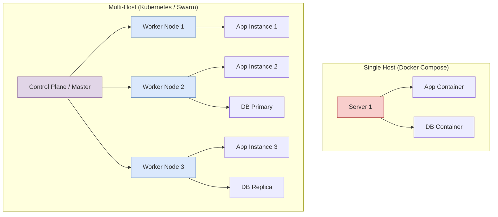

# Chapter 4.5 - Multi-host environments

## Overview

This section introduces the concept of Container Orchestration. While tools like Docker and Docker Compose are perfect for local development or running applications on a single server, they fall short when you need to distribute an application across multiple physical or virtual machines for high availability, fault tolerance, and massive scale.

---

## Learning Objectives

After completing this section, you should be able to:

- Understand the limitations of single-host container management.
- Identify the differences between Docker Swarm and Kubernetes.
- Recognize popular tools for running Kubernetes locally.
- Understand the role of Managed Cloud Kubernetes providers.

---

## Core Concepts

### Definition

**Container Orchestration**: The automated process of deploying, managing, scaling, and networking containers across a cluster of multiple host machines.

**Docker Swarm**: Docker's native, built-in orchestration tool. It combines multiple Docker hosts into a single virtual host.

**Kubernetes (K8s)**: An open-source container orchestration platform originally designed by Google. It is currently the industry's de facto standard for managing containerized workloads and services.

### Explanation

When your application grows, running it on a single machine becomes risky. If that machine crashes, your entire application goes offline. To prevent this, you deploy your application across 3, 5, or even 100 machines. But manually logging into 100 machines to run `docker run` is impossible. 

Container orchestrators solve this. You tell the orchestrator, "I need 10 instances of my web app running," and the orchestrator automatically finds available machines, downloads the images, starts the containers, and configures the load balancers so traffic is distributed evenly. If a machine crashes, the orchestrator instantly notices the missing containers and automatically restarts them on a healthy machine.

### Examples

- **Small Hobby Project:** You have 2 Raspberry Pis and want to host a personal blog with redundancy. **Docker Swarm** is perfect because it requires almost zero setup and runs natively within Docker.
- **Enterprise Application:** A global streaming service needs to automatically scale from 100 servers to 1000 servers during a major event. **Kubernetes** is required due to its immense scalability, customizability, and robust ecosystem.

### Diagrams

---

## Architecture / Workflow

### Workflow Steps for Cloud Kubernetes

1. **Provision Infrastructure:** Use a cloud provider (like AWS or Google Cloud) to rent several virtual machines.
2. **Initialize Cluster:** Use a managed service (like EKS or GKE) to turn those machines into a Kubernetes cluster, designating a Control Plane and Worker Nodes.
3. **Define Desired State:** Write YAML configuration files (similar to `docker-compose.yml` but more complex) describing how many containers you want.
4. **Deploy:** Use `kubectl` (the Kubernetes command-line tool) to send those YAML files to the Control Plane.
5. **Orchestration:** The Control Plane automatically schedules the containers onto the Worker Nodes and monitors their health.

---

## Commands Learned

*Note: In-depth orchestration commands are outside the scope of this Docker course, but here are the primary CLI tools used in the industry.*

| Command | Purpose     |
| ------- | ----------- |
| `docker swarm init` | Initializes a new Docker Swarm cluster on the current machine. |
| `kubectl` | The primary command-line tool used to communicate with a Kubernetes cluster's API. |
| `k3d cluster create` | Creates a lightweight, local Kubernetes cluster running entirely *inside* Docker containers for testing. |

---

## Practical Examples

### Example 1: Local Kubernetes Testing Tools

If you want to learn Kubernetes without paying for expensive cloud servers, you can simulate a multi-host environment on your own laptop using these tools:

- **k3s:** A highly stripped-down, lightweight version of Kubernetes originally built for IoT edge devices.
- **k3d:** A wrapper tool that runs the `k3s` software inside standard Docker containers, allowing you to spin up a "fake" cluster in seconds.
- **kind (Kubernetes in Docker):** The official testing tool developed by the Kubernetes team that also runs local clusters inside Docker containers.

---

## Quick Revision

- Docker Compose is for single hosts; Swarm and Kubernetes are for multi-host clusters.
- Docker Swarm is easy to learn and built-in, but lacks the massive ecosystem of Kubernetes.
- Kubernetes has a steep learning curve but is infinitely customizable.
- You do not always need Kubernetes; choose the tool that matches the scale of your project.

---

## Interview Questions

### Q1. What is the difference between Docker Compose and Kubernetes?

Docker Compose is a tool for defining and running multi-container applications on a **single host machine**. Kubernetes is a container orchestration platform designed to manage, scale, and maintain high availability of containers across a cluster of **multiple host machines**.

### Q2. Why might a company choose Managed Kubernetes (EKS/GKE) over installing Kubernetes themselves?

Installing, configuring, and maintaining the Kubernetes Control Plane is notoriously difficult and requires deep specialized knowledge ("Kubernetes the Hard Way"). Managed services abstract this away; the cloud provider handles the master nodes, backups, and API server uptime, allowing the company's engineers to focus solely on deploying their applications.

### Q3. What problem does Container Orchestration solve?

It solves the problems of deployment at scale, self-healing (restarting crashed containers), zero-downtime rolling updates, load balancing traffic across multiple servers, and efficient resource utilization across a fleet of machines.

---

## Common Mistakes

- **Over-engineering:** Deciding to use Kubernetes for a personal blog or a tiny application that receives very little traffic. This introduces massive, unnecessary complexity and cost when a simple Docker Compose setup on a $5/month VPS would suffice.
- **Ignoring Docker Swarm:** Believing Swarm is "dead." While K8s won the enterprise war, Swarm is still actively maintained within the Docker engine and remains a brilliant, simple solution for small-to-medium clusters.

---

## References

- [MOOC.fi Course Material: Multi-host environments](https://courses.mooc.fi/org/uh-cs/courses/devops-with-docker-spring-2026/chapter-4/multi-host-environments)
- [Docker Swarm Mode Overview](https://docs.docker.com/engine/swarm/)
- [Kubernetes Official Documentation](https://kubernetes.io/)
- [k3d (k3s in Docker)](https://k3d.io/)

---

## Key Takeaways

- Scaling beyond one server requires an orchestrator.
- Kubernetes is the industry standard but comes with a steep learning curve.
- Managed Cloud Kubernetes (EKS, GKE, AKS) is the most common way companies run K8s in production.
- Use local tools like `k3d` or `kind` to learn K8s safely and for free.
